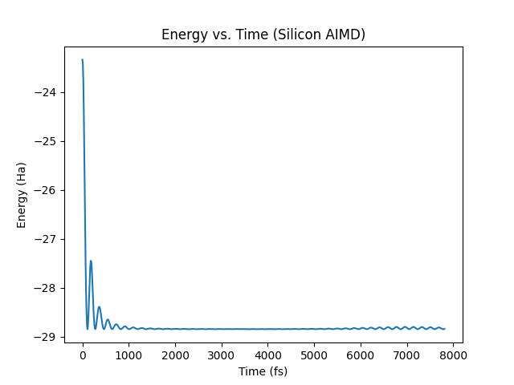
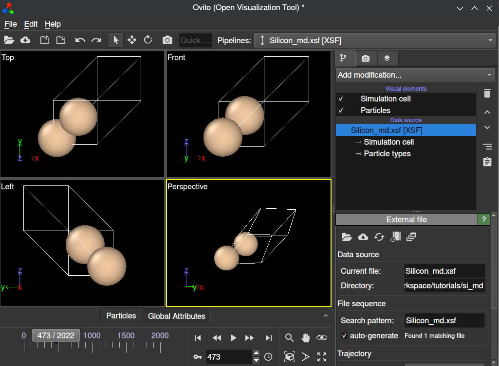

Silicon AIMD
===================

We will show an *ab-initio* molecular dynamics simulation with a silicon crystal
using QimPy. *Ab-initio* molecular dynamics (AIMD) is a technique for performing
molecular dynamics simulations using electronic structure calculations to
compute forces. Although AIMD is significantly more computationally intensive
than conventional molecular dynamics, you should find that the calculation in
this tutorial runs on ordinary consumer hardware, with significant benefits to
GPU-based computation if it is available.

The following input file defines an AIMD calculation on a perturbed
diamond-cubic silicon lattice with a Nose-Hoover thermostat. Save this text to
``Silicon_md.yaml`` in your calculation directory:

.. code-block:: yaml

   # Diamond-cubic silicon
   lattice:
     system: cubic
     modification: face-centered
     a: 5.4437022209 Angstrom
     movable: no

   ions:
     pseudopotentials:
       - SG15/$ID_ONCV_PBE-1.0.upf
     coordinates:
       - [Si, 0.75,   0.75,   0.25]
       - [Si, 0.00,   0.50,   0.50]
       - [Si, 0.75,   0.25,   0.75]
       - [Si, 0.00,   0.00,   0.00]
       - [Si, 0.25,   0.75,   0.75]
       - [Si, 0.50,   0.50,   0.00]
       - [Si, 0.25,   0.25,   0.25]
       - [Si, 0.50,   0.00,   0.50]

   geometry:
     dynamics:
       T0: 300 K
       n-steps: 5000
       dt: 10. fs
       thermostat:
         nose-hoover:
           chain-length-T: 3
       t-damp-T: 50 fs

   checkpoint: null  # disable reading checkpoint
   checkpoint-out: Silicon_md.h5  # but still create it

Now you are ready to perform the calculation:

.. code-block:: bash

    (qimpy) $ python -m qimpy.dft -i Silicon_md.yaml | tee -o Silicon_md.out

The standard output of this run will be saved to ``Silicon_md.out``, and
raw data (including forces, trajectories, and all run parameters) will be saved
to ``Silicon_md.h5`` (as instructed by ``checkpoint-out``). If this calculation
ends and you would like to restart or continue it from a checkpoint, simply
change ``checkpoint: null`` to ``checkpoint: Silicon_md.h5``. The trajectories
from this new run will be seamlessly appended to the existing checkpoint file.

.. code-block:: python

    import h5py
    import matplotlib.pyplot as plt
    import numpy as np

    silicon_md = h5py.File("Silicon_md.h5", "r")

    # Energy per step
    E = np.array(silicon_md["geometry"]["action"]["history"]["energy"])

    dt = 10. # fs
    steps = len(E)
    time = np.linspace(0, steps*dt, num=steps)

    # Temperature per step (as an example)
    T = np.array(silicon_md["geometry"]["action"]["history"]["T"])

    # Make a time series plot
    plt.ylabel("Energy vs. Time (Silicon AIMD)")
    plt.ylabel("Energy (Ha)")
    plt.xlabel("Time (fs)")
    plt.plot(time, E)

    plt.savefig("si_aimd_energy.png")

Save this script as ``energy_plot.py`` within your calculation directory (make
sure the ``Silicon_md.h5`` checkpoint file is available), and run it to produce
the following time-series plot of the system's energy:

You may just as easily extract all other time series parameters of your run as
numpy arrays for analysis (e.g. forces, positions, etc.).

Using QimPy's XSF interface, you can also easily extract this data to create an
animated XSF file for analysis with standard tools such as Ovito. You can do
this by running the following script within your calculation directory:

.. code-block:: bash

    (qimpy) $ python --animated -m qimpy.interfaces.xsf -c Silicon_md.h5 -x Silicon_md.xsf

The ``--animated`` flag makes sure that this data is parsed into an animated XSF
file. You may now open this file in Ovito, and you will be able to view an
animation of your calculation.

