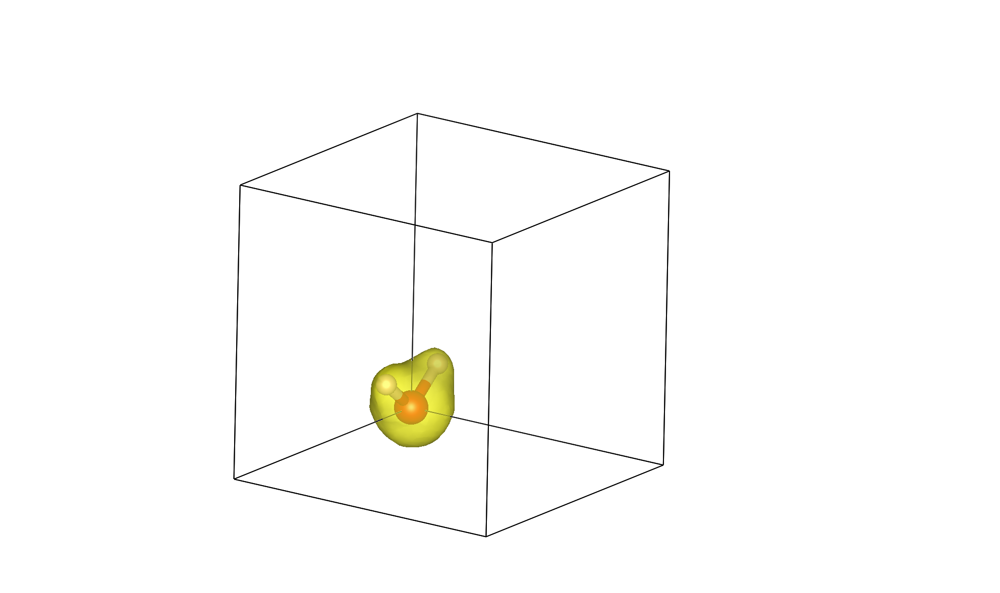

A first calculation
===================

QimPy is an electronic density-functional theory (DFT) software,
which means that its primary functionality is to calculate
the quantum-mechanical energy of electrons in an external potential,
typically from nuclei (ions) in a molecule or solid.
Specifically, the underlying theory is Kohn-Sham DFT
which involves solving the single-particle Schrodinger equation
in a self-consistent potential determined from the electron density.
This tutorial demonstrates a DFT calculation of the energy
and electron density of a water molecule.

Let's start with a water molecule as a first calculation.
Save the following to `water.yaml`:

.. code-block:: yaml

    lattice:
      system:
        name: cubic
        a: 10.0

    ions:
      pseudopotentials:
        - SG15/$ID_ONCV_PBE.upf
      fractional: no
      coordinates:
        - [H, 0., -1.432, +0.6]
        - [H, 0., +1.432, +0.6]
        - [O, 0.,  0.000, -0.6]

    checkpoint: water.h5

See :doc:`/inputfile` for details on all the settings that can be specified in YAML input.

This YAML input-file illustrates the bare minimum commands needed to set up a calculation.
The **lattice** and **ions** keys set up the unit cell and geometry, and the default parameters
for the electronic calculation are used. The **checkpoint** key specifies the name of the HDF5 file in
which data from the calculation is saved, where it can also be read at start-up to restart a
calculation.

In a plane-wave basis, bare nuclei are replaced by an effective potential
due to the nucleus and core electrons, termed the pseudopotential,
and only the remaining valence electrons are included explicitly in the DFT calculation.
The **ions/pseudopotentials** key points to the pseudopotentials specified by
the environment variable **QIMPY_PSEUDO_DIR**.

Now, that basic input file can be run with output logged to a file named "water.out" as:

.. code-block:: bash

    (qimpy) $ python -m qimpy.dft -i water.yaml -o water.out

Alternatively, to write the output to a file while also printing to standard output you can run:

.. code-block:: bash

    (qimpy) $ python -m qimpy.dft -i water.yaml | tee water.out

For more details about this stand-alone calculation check :doc:`/api/qimpy.dft.main`. That should complete in a few
seconds and create files `water.out` and `water.h5`.
Have a look at `water.out`.
It lists the key-value pairs that were specified in the input file, then the initialization of
:doc:`lattice </yamldoc/qimpy.lattice.Lattice>`, :doc:`ions </yamldoc/qimpy.dft.ions.Ions>`,
:doc:`symmetries </yamldoc/qimpy.symmetries.Symmetries>`, :doc:`electrons </yamldoc/qimpy.dft.electrons.Electrons>` and
:doc:`charge density grid </yamldoc/qimpy.grid.Grid>`, which have sensible defaults.
For instance, in :doc:`electrons </yamldoc/qimpy.dft.electrons.Electrons>` the exchange functional defaults to PBE GGA.
To use LDA instead, you would add the following to the YAML input file

.. code-block:: yaml

    electrons:
        xc:
            functional: lda_pw

The initializations are then followed by the electronic optimization, which first logs the optimization of the
electronic states in atomic-orbital subspace (lines starting with **LCAO**), then the progress of the electronic
self-consistent field iterations (lines starting with **SCF**).
The default is to minimize for 50 iterations or an energy difference between
consecutive iterations of 1e-08 Hartrees, whichever comes first.
This example converges to that accuracy in around 13 iterations.
Note that the ions have not been moved and the end of the output file lists the forces at the initial position.

To check which data is saved in the HDF5 checkpoint file, run :code:`h5dump -H water.h5` to see the header,
which lists the data saved and their data type.

Finally, let's visualize the electron density output by this calculation.
Use :doc:`/api/qimpy.interfaces.xsf` to create `water.xsf`, containing the
ionic geometry and the electron density, from HDF5 checkpoint file `water.h5`:

.. code-block:: bash

    (qimpy) $ python -m qimpy.interfaces.xsf -c water.h5 -x water.xsf --data-symbol n

You can specify 3d data to be written in the XSF file by specifying its symbol in the checkpoint file
(electron density's symbol is **n**).
Now open the XSF file using the visualization program VESTA
(or another program that supports XSF such as XCrysDen).
You should initially see the water molecule torn between the
corners of the box since it was centered at [0,0,0].
Change the visualization boundary settings from [0,1) to [-0.5,0.5)
to see the (intact molecule) image at the top of the page!
