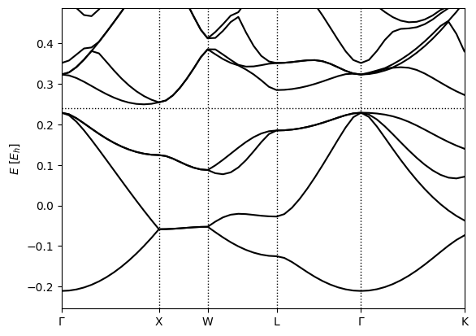

Band structure calculations
===========================

In the previous tutorial, we calculated the total energy of silicon and explored its Brillouin zone convergence. This tutorial illustrates calculations of the electronic band structure, specifically, the variation of the Kohn-Sham eigenvalues along a special kpoint path in the Brillouin zone.

First lets specify the bulk silicon energy calculation in Si.yaml, or reuse the file from the :doc:`bz`:

.. code-block:: yaml

  lattice:
    system: cubic
    modification: face-centered
    a: 10.263

  ions:
    pseudopotentials:
      - /SG15/$ID_ONCV_PBE-1.0.upf
    coordinates:
      - [Si, 0, 0, 0]
      - [Si, 0.25, 0.25, 0.25]

  electrons:
    k-mesh:
      offset: [0.5, 0.5, 0.5] #Monkhorst-Pack
      size: [8, 8, 8]
    
    xc:
      functional: gga_pbe

  grid:
    ke-cutoff: 100 #Hartree

  checkpoint_out: Si_out.h5

which can be run with 

.. code-block:: bash

   (qimpy) $ python -m qimpy.dft -i Si.yaml -o Si.out

Next, we list high-symmetry points in the Brillouin zone laying out a path along which we want the band structure, which can be put in kpoints.yaml:

.. code-block:: yaml

  include: Si.yaml

  electrons:

    fillings:
      n-bands: 10
      n-bands-extra: 5

    fixed-H: Si_out.h5 #fixed Hamiltonian so there's no more SCF

    k-mesh: null #de-specify the k-mesh from Si.yaml
  
    k-path:
      dk: 0.05
      points:
        - [0, 0, 0, $\Gamma$]
        - [0, 0.5, 0.5, X]
        - [0.25, 0.75, 0.5, W]
        - [0.5, 0.5, 0.5, L]
        - [0, 0, 0, $\Gamma$]
        - [0.375, 0.75, 0.375, K]

  checkpoint-out: null #de-specify the checkpoint file creation from Si.yaml

Note that you can overwrite previously specified values when using **include**. The high symmetry points for many structures can be found easily online, such as this `course website <http://lampx.tugraz.at/~hadley/ss1/bzones/>`_ . Or you can use the more complete `Bilbao database <https://www.cryst.ehu.es/>`_ but you'll need to know the point group of your crystal. 

Then you can calculate the band structure along the k-point path with

.. code-block:: bash

   (qimpy) $ python -m qimpy.dft -i kpoints.yaml -o kpoints.out

and if you investigate the electron fillings using :code:`h5dump -g electrons/fillings kpoints.h5` then you can see that half of the bands are filled completely, while the other half are completely empty, in line with what is expected for a semiconductor. 

And to generate the band structure plot, run 

.. code-block:: bash

   (qimpy) $ python -m qimpy.interfaces.bandstructure -c kpoints.h5 -o Si_bandstructure.png

which should produce 

Notice that at the Gamma point, the lowest band is single while the next three higher bands are degenerate: these line up with the s and p valence orbitals on the Silicon atoms. These degeneracies change in different parts of the Brillouin zone: the XW segment has two pairs of degenerate bands, while the WL and Gamma-K segments have no degeneracies.
