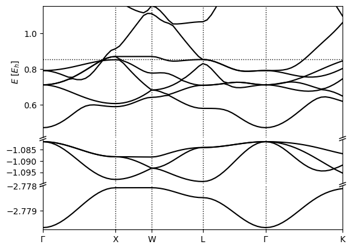

Metals
======

Silicon, the crystalline solid we have worked with is a semiconductor with a band gap which we identified in the tutorials in :doc:`band_structures`. This gap clearly demarcates occupied states from unoccupied states for all k-points, so electron 'fillings' are straightforward: the lowest (nElectrons/2) bands of all k-points are filled, and the remaining are empty. This is no longer true for metals, where one or more bands are partially filled, and these fillings (or occupation factors) must be optimized self-consistently. This tutorial introduces such a calculation for platinum.

Platinum is a face-centered cubic metal with a cubic lattice constant of 3.92 Angstroms (7.41 bohrs), which we can specify easily in the input file Pt.yaml:

.. code-block:: yaml

    lattice:
      system:
        name: cubic
        modification: face-centered
        a: 3.92 Å

    ions:
      pseudopotentials:
        - SG15/$ID_ONCV_PBE.upf
      coordinates:
        - [Pt, 0, 0, 0] #just one atom per unit cell
     
    electrons:
      k-mesh: 
        size: [12, 12, 12]
       
      fillings:
        smearing: fermi
        kT: 0.01 #Hartree
      
    grid:
      ke-cutoff: 100 #Hartree
      
    checkpoint_out: Pt_out.h5

The only new command is elec-smearing which specifies that the fillings must be set using a Fermi function based on the current Kohn-Sham eigenvalues, rather than determined once at startup (the default we implicitly used so far). The first parameter of this command specifies the functional form for the occupations, in this case selecting a Fermi function (see :doc:`fillings </yamldoc/qimpy.dft.electrons.Fillings>` for other options). The second parameter determines the width in energy over which the Fermi function goes from one to zero (occupied to unoccupied).

Metals are much more sensitive to k-point sampling, because for some bands, a part of the Brillouin zone is filled and the remainder is empty, separated by a Fermi surface. The number of k-points directly determines how accurately the Fermi surface(s) can be resolved. The Fermi temperature is essentially a smoothing parameter that allows us to resolve the Fermi surface accurately at moderate k-point counts. Note that the tempreature we chose is around ten times room temperature in order to increase the smoothing and use a practical number of k-points.

Run the calculation using 

.. code-block:: bash

  (qimpy) $ python -m qimpy.dft -i Pt.yaml -o Pt.out

and examine the output file. The main difference is that every SCF line is preceded by a line starting with FillingsUpdate. This line reports the chemical potential, mu, of the Fermi function that produces the correct number of electrons with the current Kohn-Sham eigenvalues, and the number of electrons, nElectrons, which of course stays constant.

Also notice that the energy in the SCF lines is called F instead of Etot. The total energy Etot satisfies a variational theorem at fixed occupations, which we dealt with so far. However, now the occupations equilibrate at a specified temperature T, and the Helmholtz free energy F = E - TS, where S is the electronic entropy, is the appropriate variational free energy to work with. Note the corresponding changes in the energy component printout at the end as well. Additionally, in the initialization, note that nBands is now larger than nElectrons/2, since the code needs a few empty states to use Fermi fillings.

Then you can specify the k-point path through the Brillouin Zone similarly to :doc:`band_structures` in kpoints.yaml:

.. code-block:: yaml

  include: Pt.yaml

  electrons:

    fillings:
      n-bands: 12
      n-bands-extra: 5

    fixed-H: Pt_out.h5 #fixed Hamiltonian so there's no more SCF

    k-mesh: null #de-specify the k-mesh from Si.yaml

    k-path:
      dk: 0.05
      points:
        - [0, 0, 0, $\Gamma$]
        - [0, 0.5, 0.5, X]
        - [ 0.25, 0.75, 0.5, W]
        - [0.5, 0.5, 0.5, L]
        - [0, 0, 0, $\Gamma$]
        - [ 0.375, 0.75, 0.375, K]

  checkpoint-out: null #de-specify the checkpoint file creation from Pt.yaml

and run it with 

.. code-block:: bash

   (qimpy) $ python -m qimpy.dft -i kpoints.yaml -o kpoints.out

Now when you inspect the electron fillings at each k-point using :code:`h5dump -g electrons/fillings kpoints.h5` you should see that some bands completely filled, some bands are completely empty, and in the middle there are some partially filled bands, implying they've crossed the Fermi level. 

Finally you can produce the band structure plot with 

.. code-block:: bash

   (qimpy) $ python -m qimpy.interfaces.bandstructure -c kpoints.h5 -o Pt_bandstructure.png

which should produce 

