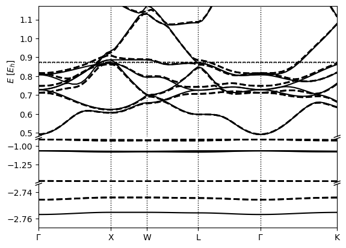

Spin-orbit Coupling
==================

Most density-functional theory calculations are based in non-relativistic
quantum mechanics, where spin decouples completely from the spatial degrees
of freedom and only enter in the orbital occupations.
Far from the atoms, the electron velocities are indeed much smaller than the
speed of light and the non-relativistic approximation is valid.
This is however no longer true close to the nuclei for electrons
with non-zero angular momentum.
Importantly, even valence electrons (with l > 0) in heavy atoms
pick up relativsitic effects - especially spin-orbit coupling -
from the regions of space close to the nuclei.
This tutorial demonstrates the effect of spin-orbit coupling
on the band structure of metallic platinum.

In plane-wave calculations using pseudopotentials,
these relativistic effects can be built into the pseudopotentials.
The SG15 pseudopotentials we have used so far do not have relativistic versions available,
so we will use pseudopotentials from `Pseudo Dojo <http://www.pseudo-dojo.org/>`_. 
Download scalar relativistic (SR) and full relativistic (FR) pseudopotentials and store them in separate directories, ``$SR`` and 
``$FR`` (as the SR and FR pseudopotentials share file names for any given atom).

Unpacked the tar files as follows: 

.. code-block:: yaml

      tar -zxvf $SR/nc-sr-05_pbe_stringent_upf.tgz # Non (Scalar) Relativistic 
      tar -zxvf $FR/nc-fr-04_pbe_stringent_upf.tgz # Full Relativistic

Your pseudopotential paths should now be: 

.. code-block:: yaml
      
      $FR/Pt.upf   #the relativistic one
      $SR/Pt.upf   #the non-relativistic one

We first run the non-relativistic calculation (but with the new Pseudo Dojo pseudopotential)

.. code-block:: yaml

    lattice:
      system: cubic
      modification: face-centered
      a: 7.41

    ions:
      pseudopotentials:
        - $SR/ID.upf
      coordinates:
        - [Pt, 0, 0, 0]

    electrons:
      spinorial: no
      fillings:
         smearing: fermi
         sigma: 0.01
      k-mesh:
        size: [12, 12, 12]
      xc:
        functional: gga_pbe
      basis: 
        ke-cutoff: 45 # Higher wavefunction cutoff as determined from Pseudo Dojo website

      checkpoint_out: Pt_out.h5

Save the above input commands in ``Pt.yaml``. To change the calculation for a spinorial calculation, change the line ``spinorial: no`` to ``spinorial: true`` and change the pseudopotential line to:

.. code-block:: yaml
    
    pseudopotentials:
      - $FR/$ID.upf

Remember to also change the value given for ``checkpoint_out`` for the new relativistic calculation. We choose our new checkpoint filename: 

.. code-block:: yaml
      
      checkpoint_out: Pt_soc_out.h5

Save the new input file, with the necessary alterations for a relativistic calculation, in ``Pt.soc.yaml`` and run as before. 

Now we run both the nonrelativistic and relativistic band structure calculations. For the nonrelativistic calculation, we use an input file, ``kpoints.yaml``: 

.. code-block:: yaml

      include: Pt.yaml

      electrons:
        fillings:
          n-bands: 12
          n-bands-extra: 5

      fixed-H: Pt_out.h5 #fixed Hamiltonian so there's no more SCF

      k-mesh: null #de-specify the k-mesh from Si.yaml

      k-path:
        dk: 0.05
        points:
          - [0, 0, 0, $\Gamma$]
          - [0, 0.5, 0.5, X]
          - [ 0.25, 0.75, 0.5, W]
          - [0.5, 0.5, 0.5, L]
          - [0, 0, 0, $\Gamma$]
          - [ 0.375, 0.75, 0.375, K]

      checkpoint-out: kpoints_out.h5

For the relativistic band structure calculation, we create a new input file, ``kpoints.soc.yaml``: 

.. code-block:: yaml

      include: Pt.soc.yaml

      electrons:
        fillings:
          n-bands: 24
          n-bands-extra: 10

      fixed-H: Pt_soc_out.h5 #fixed Hamiltonian so there's no more SCF

      k-mesh: null #de-specify the k-mesh from Si.yaml

      k-path:
        dk: 0.05
        points:
          - [0, 0, 0, $\Gamma$]
          - [0, 0.5, 0.5, X]
          - [ 0.25, 0.75, 0.5, W]
          - [0.5, 0.5, 0.5, L]
          - [0, 0, 0, $\Gamma$]
          - [ 0.375, 0.75, 0.375, K]

      checkpoint-out: kpoints_soc_out.h5

We then plot the overlayed band structures as follows:

.. code-block:: yaml

      python -m qimpy.interfaces.bandstructure -c "kpoints_out.h5 kpoints_soc_out.h5"  -o Pt_soc_bandstructure.png     

Which should produce: 

